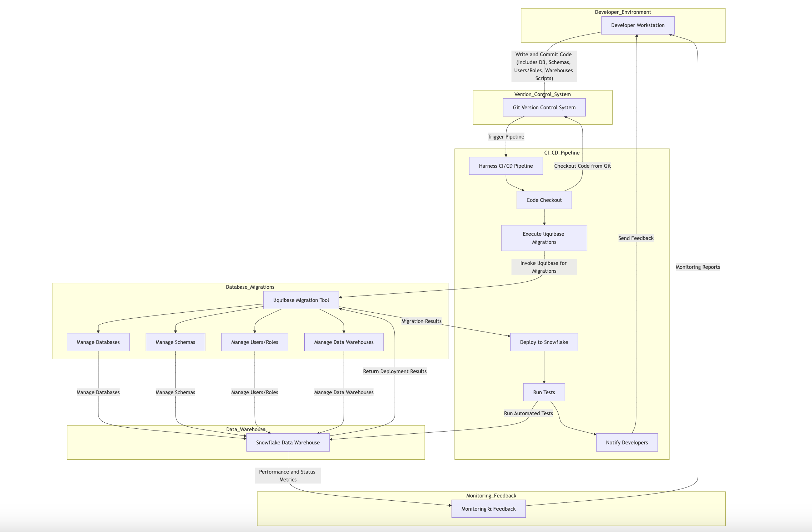

# **Automation of Snowflake Resource Deployment Using Harness**

## Collaborators

| Names             | Roles   | Emails                       | GitHub Handles |
| :---------------- | ------- | ---------------------------- | -------------- |
| Supriya Nanjundaswamy| Mentor  |   snanjundaswamy1@StateStreet.com                           |                |
| Yashaswi Upmon    | Mentor  | YUpmon@StateStreet.com                             |                |
| Rishi Dubey       | Mentor  | RDubey8@StateStreet.com                             |                |
| James Colley      | Mentor  | JColley@StateStreet.com                             |                |
| Amruth Niranjan   | Student | amruth@bu.edu                | amruth-sn      |
| Hrishav Varma     | Student | hri@bu.edu                   | VHri               |
| Krish Shah        | Student | kshah26@bu.edu               | krish-shahh    |
| Yuzhe Xu          | Student | yx8756a@bu.edu               |  yuzhexu       |
| Rithvik Nakirikanti| Student |rithvikn@bu.edu               | rithvik213               |

## **Project Description**

This project focuses on automating the deployment and management of Snowflake resources using CI/CD pipelines, specifically leveraging Liquibase for database migrations and Harness for orchestration. The goal is to streamline the creation, modification, and deletion of key Snowflake resources, including databases, schemas, users, roles, and data warehouses, in a secure and scalable manner.

---

## **1. Vision and Goals of the Project**

The project aims to deliver an automated, secure, and efficient pipeline for managing Snowflake resources, scalable to diverse workloads. By integrating Liquibase and Harness, this solution will enable teams to deploy database changes and resource configurations with minimal manual intervention. The automation will improve deployment consistency, reduce errors, and ensure secure and auditable management of Snowflake environments.

Key goals:
- Automate Snowflake resource deployments via CI/CD pipelines.
- Establish version control system for database migrations using Liquibase.
- Ensure secure and role-based access control for Snowflake resources.
- Develop a scalable and easy-to-manage pipeline using Harness.
- Build CLI tools to generalize the solution for broader adoption.

---

## **2. Users/Personas of the Project**

The project will primarily serve the following user personas:

- **DevOps Engineers**: Manage the CI/CD pipelines and ensure smooth deployment of Snowflake resources.
  - **Interaction**: Configure and manage CI/CD pipelines in Harness, monitor performance, and troubleshoot issues.
  
- **Database Administrators**: Oversee Snowflake resource configurations and use the automation to deploy database changes.
  - **Interaction**: Review and approve Liquibase migration scripts, ensure resource integrity, and manage performance.

- **Data Engineers**: Manage the data warehouse environment and ensure that changes to databases and schemas are rolled out without manual intervention.
  - **Interaction**: Monitor data warehouse performance, validate data integrity post-deployment, and provide feedback for improvements.

- **Security Engineers**: Monitor and manage role-based access control and ensure the secure deployment of resources.
  - **Interaction**: Set up access controls, conduct audits, and monitor for security breaches.

---

## **3. Scope and Features of the Project**

### **In-Scope Features**:
- Automation of the following Snowflake resources using Liquibase and Harness:
  - Databases
  - Schemas
  - Users and Roles
  - Data Warehouses
- CI/CD pipeline configuration using Harness for managing different deployment environments (development, staging, production).
- Secure handling of credentials with role-based access control policies.
- Integration of Snowflake Cortex and ML capabilities for classification and forecasting.

### **Out-of-Scope Features**:
- Real-time data streaming or ingestion processes.
- Data integration solutions beyond database and resource management.

---

## **4. Solution Concept**

### **Global Architectural Structure of the Project**:
The solution revolves around leveraging Liquibase to manage Snowflake database migrations and using Harness to orchestrate automated CI/CD workflows. The key components include:
- **Liquibase**: Manages version-controlled SQL migration scripts for Snowflake resources.
- **Harness**: Orchestrates the CI/CD pipeline, automatically triggering deployments upon changes to the codebase.
- **Snowflake**: The target data warehouse environment where databases, schemas, and user roles will be managed.
- **Version Control (Git)**: Manages code changes and triggers CI/CD pipelines.

### **Design Implications and Discussion**:
- **Liquibase** ensures a consistent and trackable process for database schema management.
- **Harness** allows for secure and automated deployment, reducing manual errors and improving deployment efficiency.
- **Security**: Proper access control and credentials management is critical in managing a cloud-based data warehouse such as Snowflake.

---

## **5. Acceptance Criteria**

- Successfully automate the creation, modification, and deletion of Snowflake resources (databases, schemas, users/roles, data warehouses) using Liquibase and Harness.
- CI/CD pipelines are fully functional and automatically trigger on code changes.
- Secure handling of credentials with proper role-based access control implemented in Snowflake.
- Full testing is completed, and rollback mechanisms are in place to handle any deployment failures.

### **Stretch Goals**:
- Implement logging and monitoring of deployment pipelines.
- Advanced role-based access management for complex team structures.

---

## **6. Release Planning**

### **Initial Release**:
- Basic CI/CD pipelines for managing Snowflake databases and schemas.

### **Subsequent Releases**:
- Expansion to handle user and role management within Snowflake.
- Full integration of all Snowflake resources in the deployment pipeline.
- Error handling, rollback mechanisms, and enhanced security features.

### **Sprint 1**:
- Understanding Project Details
- Defined system architecture and tools and created the System Architecture Diagram
- Initial setup of the pipeline architecture.
- Designed initial Liquibase migration scripts for database and schema management and implemented logging.
- [Sprint 1 Video](https://drive.google.com/drive/folders/1FYhqfLBLhWEPeXGALiEiEtfvOnB7ttHl?usp=sharing) | [Sprint 1 Slides](https://docs.google.com/presentation/d/1gbFB89ISR1-bjAJkVJ8YOSL3uXDYEvGVyaydHF2R1Cs/edit?usp=sharing)

### **Sprint 2**:
- Complete the first fully functional CI/CD pipeline for Snowflake, integrating Liquibase with Harness.
- Integrated Git version control for automated deployments.
- Configured rollback mechanisms and developed unit tests for migration rollbacks.
- [Sprint 2 Video](https://drive.google.com/drive/folders/1_muHJiXmQ-1mgOg3jnMmuH9rbIDCQsTb?usp=sharing) | [Sprint 2 Slides](https://docs.google.com/presentation/d/1ZELijHprziXk3Q5UXp_wHYXuJceKIPzLYCy5MiPF_Ik/edit?usp=sharing)

### **Sprint 3**:
- Implemented Role-Based Access Control (RBAC) for secure credential management.
- Created a template warehouse and integrated its scaling with CI/CD pipelines.
- Created comprehensive documentation for the users of the project.
- [Sprint 3 Video](https://drive.google.com/file/d/1MlyRKoTGYykNP8E03Tp-Z1xPtsGQeNaK/view?usp=sharing) | [Sprint 3 Slides](https://docs.google.com/presentation/d/1oo64tsNJ4J1BjkL7lLYIwxzd5AwXJsT1zKz8GyOEZNY/edit?usp=sharing)
- 
### **Sprint 4**:
- Automated Snowflake warehouse scaling with scripts.
- Conducted unit and pipeline testing with large public datasets.
- Researched and integrated AI/ML features, including Cortex and Snowflake ML Studio.
- Delivered a Snowflake Cortex demo and team training on Snowflake Quickstart tutorials.
- [Sprint 4 Video](https://drive.google.com/file/d/1ljrr8xlniqnSNjIbKzDZrL4hju8Yl5at/view?usp=sharing) | [Sprint 4 Slides](https://docs.google.com/presentation/d/1BbEi-MSP-O3caEmN2Q2xDliHprDnXxBVlXpTcVVYS3g/edit?usp=sharing)

### **Sprint 5**:
- Created a CLI tool for any users to integrate this pipeline with their general use cases.
- Efforts to enhance the visibility of the project - Published a Medium article and promoted the project on forums.
- Enhanced documentation with starting and troubleshooting steps.
- [Sprint 5 Video](https://drive.google.com/file/d/1DSwadtQEzQR0N0LV9LPPTnvupUkuFL-B/view?usp=drive_link) | [Sprint 5 Slides](https://docs.google.com/presentation/d/1Vw8HhjRABkKVcA8WRRrBYlEDu-vn3-4ze1cFHg0mvqo/edit?usp=sharing) | [Medium Article](https://medium.com/@rithvik213/automation-of-snowflake-resource-deployment-using-harness-c55eb20e78ba) | [Snowpilot GitHub Repository](https://github.com/amruth-sn/snowpilot)

### **Final Presentation**:
- 
- [Final Demo Video]() | [Final Demo Slides]()

